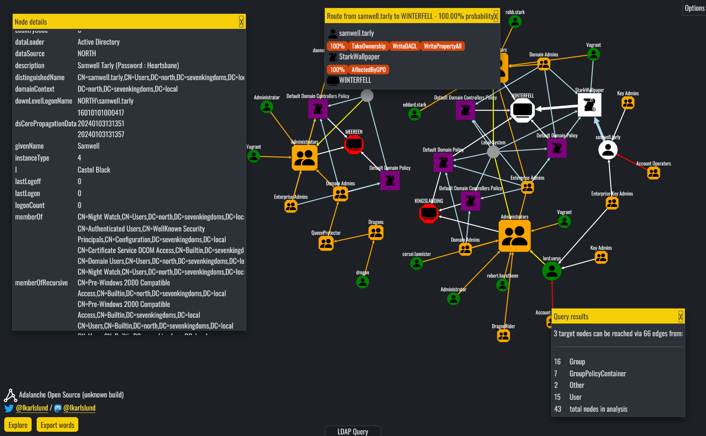

# Adalanche Sample Data

*Explore the GOAD Active Directory lab in 5 minutes with [Adalanche - Active Directory ACL Visualizer and Explorer](https://github.com/lkarlslund/Adalanche)*



This repository provides sample data from the [Orange Cyberdefense lab GOAD](https://github.com/Orange-Cyberdefense/GOAD) project. It is a vulnerable Active Directory lab consisting of 5 Windows machines (3 DCs across 2 forests) and 2 Windows servers. There is a multitude of vulnerabilites available, and you can explore them using Adalanche and decide whether you want to spin up a lab to explore further.

## Contents

- 3 Domain Controller dumps including GPOs
- 5 Local Machine dumps

## How to use

Load this into [Adalanche](https://github.com/lkarlslund/Adalanche) by following this short guide:

1. Download latest [release](https://github.com/lkarlslund/Adalanche/releases/latest) or recent [development build](https://github.com/lkarlslund/Adalanche/releases/tag/devbuild)
2. Clone this repository, or download as a ZIP file and decompress it
3. Launch Adalanche, pointing it to your cloned repository: ```adalanche analyze --datapath [path-to-cloned-repository]/goad/```

## Next steps

Documentation for Adalanche: information in the [readne](https://github.com/lkarlslund/Adalanche)
Deploy the lab: there's an easy to use [script for Ubuntu 22.04](https://github.com/lkarlslund/deploy-goad) available, or visit the [GOAD lab repository](https://github.com/Orange-Cyberdefense/GOAD) directly
Further reading: links to sites about [attacks on Active Directory](https://github.com/lkarlslund/adalanche#further-reading-on-active-directory-attacks)

__HUGE THANKS to Orange Cyberdefense // Mayfly277 // contributors for providing the lab!__

### Have fun!